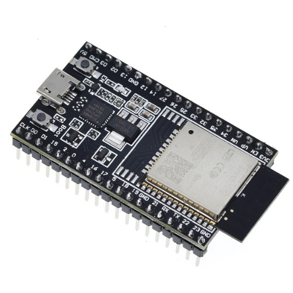

# ESP32 Project - Intro

## ESP32. Tiny, but Powerful🜨

ESP32는 Espressif사의 소형 마이크로컨트롤러 보드입니다.
아두이노의 개발환경과 방대한 라이브러리를 그대로 사용할 수 있습니다.

<small>Figure 1. ESP32-DevKitC V4 보드</small>

ESP32에는 다양한 칩과 개발보드가 있습니다.
그 중에서도 현재(2026년) 가성비가 좋은 **ESP32-C3**와 고성능인 **ESP32-S3**를 비교하면 아래와 같습니다.

<small>Table 1. ESP32-C3와 ESP32-S3의 스펙 비교</small>

|    항목     |      ESP32-C3      |          ESP32-S3          |
| :-------: | :----------------: | :------------------------: |
|    CPU    | RISC-V 싱글코어 160MHz |   Xtensa LX7 듀얼코어 240MHz   |
|    RAM    |     400KB SRAM     | 512KB SRAM (+PSRAM 최대 8MB) |
|   WiFi    |  Wi-Fi 4 (2.4GHz)  |      Wi-Fi 4 (2.4GHz)      |
| Bluetooth |      BLE 5.0       |          BLE 5.0           |
|   GPIO    |       16~22개       |            45개             |
|    USB    |   USB-C(Serial)    |         USB-C(OTG)         |
|   AI 가속   |         없음         |          벡터 확장 지원          |
|    특징     |      저전력, 저가       |      고성능, 카메라, AI 지원       |
|    가격대    |      3,400원(납땜X)~       |          8,200원(납땜X)~           |

ESP32는 저렴하면서도 **WiFi와 블루투스 기능을 제공**하여 사물인터넷(IoT)의 게임체인저라고 불립니다.
스스로 웹서버가 되어 센서의 측정값을 **WiFi를 통해 스마트폰으로 직접 출력**할 수 있습니다.

---

## 기상관측드론을 위한 ESP32 소형 기상관측기

>기상예보관 시절, 지상의 기상관측소는 많이 있었지만 정작 필요한 지점의 데이터가 없는 경우가 많았고, 
>상층 대기 관측 데이터의 부족으로 뇌우 등 악기상을 예상하고 실황을 파악하는데 어려움을 많이 겪었습니다.

당시의 어려움은 오래도록 마음에 남아 최근 기상관측드론을 만들기 시작했습니다.
드론에 장착할 공간은 협소하기 때문에 장착할 기상관측기는 작고, 가벼워야 합니다.

따라서, 작고 강력한 ESP32로 기상관측드론에 장착할 소형 기상관측기를 만들고자 합니다.
그리고 ESP32 MBL을 어디까지 구성가능한지, 실험에 사용할 수 있는지도 시도해보려고 합니다.

본 프로젝트는 두 파트로 나누어 진행합니다.

I. **ESP32-C3 SuperMini** — 베이스보드 & 가성비 MBL 구성
저렴하고 구하기 쉬워서, 센서 하나하나를 익히고 회로를 검증하는 단계에 적합합니다.

II. **seeedstudio XIAO ESP32-S3** — 초소형 고성능 실전 보드
C3보다 성능이 우위인 S3로 ESP32의 성능을 최대한 활용하는 ESP32 기상관측기를 구성해보고,
이를 더욱 소형화하여 드론에 장착하고자 합니다.

앞으로 SuperMini C3로 ESP32 MBL 기본기를 다지는 과정을 먼저 소개하고,
이후 XIAO S3로 옮겨 드론에 장착하는 과정을 이어서 포스팅하겠습니다🜨

---

  <a href="/docs/index.md">← 홈으로</a>
  <a href="/docs/esp32/c3/settings.md">다음: ESP32-C3 SuperMini →</a>

